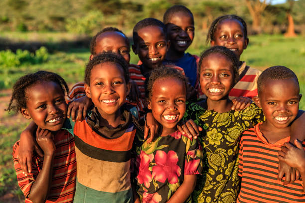

# 🌍 Grid Web - Charity Awareness Website

This project is a **responsive, grid-based charity awareness webpage** built with HTML and CSS. It showcases an organization dedicated to serving communities through food, water, medical aid, and education.

## 🔥 Features

- 🌟 Hero section with a bold message and CTA buttons
- 🍱 Service section with four key focus areas
- 💬 Informational section with image and summary
- ✅ Core values grid highlighting organization principles
- 🎨 Responsive layout using CSS Grid
- 📸 Custom image assets (placed in `./assets/` folder)

## 🖼️ Screenshots

  
*Hero banner area with mission statement*

---

## 🗂️ Project Structure

```
grid-web/
├── index.html
├── assets/
│   ├── image1.jpg    # Hero section background
│   ├── image3.png    # Icons (tick)
│   ├── image4.png    # Service icons
│   └── image5.jpg    # Informational section image
```

> Make sure all assets are located correctly in the `assets/` folder.

---

## 📦 How to Run Locally

1. Clone the repository:
   ```bash
   git clone https://github.com/your-username/your-repo-name.git
   ```
2. Open `index.html` in any modern web browser.

---

## 💡 Customization

- Replace images in the `assets/` folder with your own.
- Modify content in `index.html` to reflect your organization’s mission.
- Style changes can be made inside the `<style>` tag in the `<head>` section or moved to a separate `style.css`.

---

## 🙌 Contribution

Feel free to fork and enhance this project! Suggestions and pull requests are welcome.

---

## 🧑‍💻 Author

- [Your Name](https://github.com/your-username)

---

## 📄 License

This project is licensed under the [MIT License](LICENSE).
